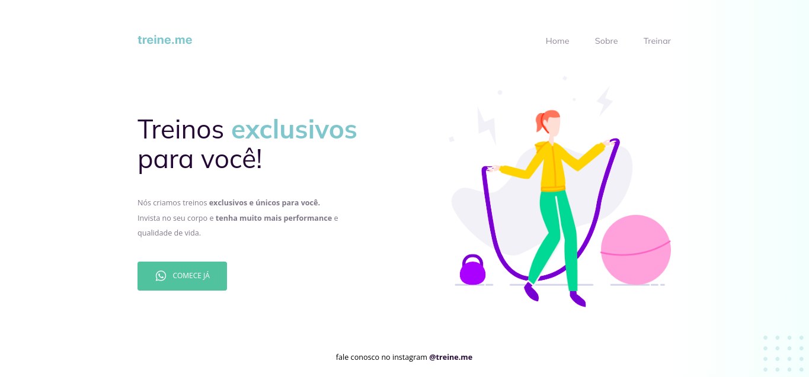

# Semântica e acessibilidade - Stage 02 (Explorer)

### Linguagens usadas: HTML e CSS

=> Nesse desafio recebemos um código igual o projeto desenvolvido no Desafio 02, mas ao contrário, ele não apresenta a semântica correta. Apesar de continuar funcionando normalmente, ao abrir o código nos deparemos com os elementos do HTML todos bagunçados e fora dos padrões atuais de acessibilidade e semântica.

 

## Projeto finalizado

